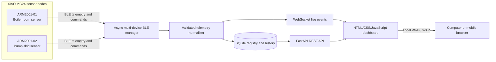

# Seed MG24 Multi-Sensor Gateway

This repository contains firmware for Seeed Studio XIAO MG24 Sense sensor nodes, a headless Raspberry Pi BLE gateway, a local FastAPI/WebSocket dashboard, and the original Tkinter USB/BLE desktop tool.

Finished sensor products are shipped with production firmware and an unassigned commissioning state. The local dashboard can assign their permanent `node_id`, persist supported configuration over BLE, read it back, and activate an installation only after live telemetry is verified. A blank development board still needs USB, but the loopback-only dashboard firmware service installs only a hash-verified application package selected by hardware serial; it accepts neither paths nor uploader arguments from the browser.

Identity and operational configuration use separate redundant NVM3 records. Ordinary BLE onboarding is write-once for identity. Only the USB recovery protocol exposes allowlisted `configuration_only` and `application_factory` reset scopes; neither is a chip erase. See `sensor_package/docs/device-identity.md`.

> This is a monitoring system. It is not an independently engineered or certified equipment-protection or safety control. Authentication and TLS must be added before exposing the dashboard outside a trusted LAN.

## Architecture



The MG24 owns time-sensitive acquisition, filtering, configured calibration hooks, feature calculation, immediate state transitions, telemetry scheduling, sequence numbers, device uptime, and short bounded buffering. The Raspberry Pi owns registration, BLE lifecycle management, authoritative history, presentation, alarm acknowledgement in a future phase, and longer-term analysis.

## Equipment identity

Every board has two deliberately separate names:

- `device_id`: permanent, unique equipment identity such as `ARM2001-01`. It is not normally editable.
- `display_name`: editable operator-facing text such as `Boiler room sensor, west wall`.

BLE name and address are connection metadata, not equipment identity. Multiple boards may continue advertising `XIAO-MG24-Sense`. The gateway classifies compatibility using the telemetry service UUID, reads stable metadata after connection, and records the last observed address without depending on it as identity. It never auto-registers discoveries.

The default configurable equipment-ID expression is `^[A-Z0-9]+(?:-[A-Z0-9]+)*$`; it is not tied to one prefix.

## Nodes, attached sensors, interfaces, and channels

The original gateway used `RegisteredDevice.device_id` for the MG24 board. That database meaning is preserved for backward compatibility and is exposed as `node_id` by the new API. It is not silently reinterpreted.

```text
MG24 node (node_id; legacy RegisteredDevice.device_id)
├── interface_id D0
│   └── attached installation (installation_id)
│       ├── equipment device_id
│       ├── editable display_name
│       ├── pinned sensor_profile_id and version
│       └── logical measurement channel(s)
└── interface_id D1
    └── another attached installation
```

One node can therefore host several attached sensors. An installation's `device_id` is permanent and unique, while its `display_name` remains editable. Readings retain their original node history and gain an optional installation mapping after an installation becomes active.

At startup, an idempotent SQLite migration adds the installation mapping column and creates installation, provisioning-history, and audit tables. Existing registered devices and readings are not deleted or rewritten. Back up the stopped SQLite database before deploying a new gateway version.

## Add Sensor wizard

1. Register or select an MG24 node. Node registration is separate from attached-sensor registration.
2. Select an interface actually reported for that node. Occupied exclusive interfaces are disabled.
3. Select a profile filtered by interface type and capability requirements. Lifecycle status is always visible.
4. Assign the attached sensor's permanent `device_id`, editable `display_name`, location, and description.
5. Configure only the profile-allowed bounded sample, processing, report, heartbeat, and filter fields.
6. Read profile wiring notes and explicitly confirm the interface and hardware documentation. Generic inputs provide no invented wiring guidance.
7. Create a draft and preview recent raw telemetry. The preview reports absent, stale, constant, and quality state; changing data is not proof of calibration.
8. Review node, interface, identity, profile/version, units, intervals, filter, calibration, and alarm state; then confirm apply.
9. The gateway receives a device acknowledgement, reads persisted identity/configuration back from the MG24, and requires recent valid telemetry before marking the installation active.

Provisioning states are `draft`, `validating`, `ready_to_apply`, `applying`, `verifying`, `active`, `failed`, `disabled`. Transaction IDs and attempts are persisted. Per-node and per-interface locks prevent concurrent overwrites. Retrying an already active transaction is idempotent. Initial failures remain visibly failed and disabled; a failed replacement restores the previous active configuration and records the replacement error.

Current D0-D5 and built-in interfaces report `configuration_supported=false`. For those interfaces the validator accepts only the established firmware defaults (100 ms sample/process/report, 30 s heartbeat, and the profile's existing filter behavior). The Pi persists the installation mapping and verifies live telemetry but does not pretend to change unsupported per-interface firmware timing. Future firmware may truthfully advertise a transaction-capable interface and use a registered node configurator.

## Declarative sensor profiles

Profiles use canonical UTF-8 JSON. JSON was chosen because it is data-only, supported by both Python and browsers, and avoids executable YAML tags or a new parser dependency. Profiles cannot contain code, imports, templates, expressions, or downloaded plugins.

The strict schema is implemented in `gateway/profiles/models.py`. Unknown fields are rejected. It includes:

- Schema version, unique profile ID, independent semantic profile version.
- Manufacturer, exact model, category, description, datasheet reference.
- Lifecycle state: `draft`, `unverified`, `verified`, `deprecated`, or `disabled`.
- Interface type/capabilities, signal-conditioning and wiring notes, supply/signal facts when known.
- Logical measurement channels, raw type/unit, optional engineering unit/range.
- Allowlisted conversion: `unconfigured`, `identity`, `linear`, `piecewise_linear`, bounded-degree `polynomial`, or `lookup_table`.
- Sampling bounds, supported filters, alarm capability/defaults, firmware requirements, and provenance.

Semantic validation rejects duplicate profile ID/version pairs, unknown fields, inverted ranges, missing conversion parameters, unordered lookup points, unbounded polynomial degrees, threshold values when defaults are disabled, calibrated conversion without engineering units, deprecated profiles without replacements, and verified status without verifier and provenance reference.

Only `verified` profiles are presented as ready for validated use. Draft and unverified profiles retain their visible status. Disabled and deprecated profiles cannot be used for new installations. Installed records pin the exact profile ID and version; changing a file does not update them. Profile upgrades require the explicit upgrade endpoint and re-provisioning, and existing reading history remains intact.

### Starter profiles

Bundled profiles are limited to behavior already present in this repository:

- Seeed XIAO MG24 Sense built-in microphone.
- LSM6DS3 accelerometer.
- LSM6DS3 gyroscope.
- Existing firmware battery-voltage channel.
- Generic analog raw input.

The generic analog profile is `unverified`, uses `adc_count`, has conversion unconfigured, and has calibration and alarms disabled. No real external manufacturer profile is included without authoritative specifications.

### Add a profile without editing application code

Place a validated `.json` file in the configured `SEED_MG24_SENSOR_PROFILE_DIRECTORY` and reload:

```bash
curl -X POST http://127.0.0.1:8000/api/sensor-profiles/reload
curl http://127.0.0.1:8000/api/sensor-profiles/errors
```

Administrators may also submit raw JSON data to `POST /api/sensor-profiles/import`. Upload size is bounded, existing ID/version pairs cannot be overwritten, the file is atomically installed, the registry is reloaded, and an audit event records profile status and claimed source. This local-network phase has no authentication, so restrict this endpoint at the network boundary. Profile URLs are metadata only; the gateway never downloads executable plugins or firmware from them.

Use `POST /api/sensor-profiles/validate` before import. Invalid profile files are reported to the administrator without preventing valid profiles or the gateway from loading.

## Independently versioned products

```text
sensor_package/         MG24 firmware, profiles, build/flash/release tools and tests (0.1.0)
gateway/                Raspberry Pi BLE/API/SQLite/dashboard product and tests (0.1.0)
shared_protocol/        authoritative versioned BLE schemas and compatibility matrix (1.0.0)
legacy/desktop_dashboard/ preserved Tkinter/serial desktop tool
docs/                   repository architecture, compatibility, and development workflow
```

See [sensor_package/README.md](sensor_package/README.md), [gateway/README.md](gateway/README.md), and [shared_protocol/README.md](shared_protocol/README.md). No firmware source or build logic is part of the gateway application, and the sensor package has no Raspberry Pi web or database dependency.

## Raspberry Pi prerequisites and installation

Use Raspberry Pi OS with Python 3.11 or a supported newer version, working Bluetooth, and network access. From a local checkout:

```bash
sudo SEED_MG24_SERVICE_USER=seed-mg24 bash ./gateway/scripts/install_raspberry_pi.sh
sudo nano /etc/seed-mg24-gateway.env
sudo systemctl start seed-mg24-gateway
```

The installer creates `/opt/seed-mg24`, a virtual environment, a dedicated service account in the `bluetooth` group, `/opt/seed-mg24/data`, and the systemd unit. It does not use Docker.

For a manual development run:

```bash
python3 -m venv .venv
. .venv/bin/activate
pip install -r gateway/requirements.txt
cp .env.example .env
python -m gateway
```

The configured default is `0.0.0.0:8000`. Another WAP client can normally open:

```text
http://<raspberry-pi-ip-address>:8000
```

This requires the Pi firewall to allow TCP 8000 and the WAP to permit client-to-client traffic. Guest/client isolation can prevent access even when both devices have Wi-Fi. Binding to `0.0.0.0` exposes the unauthenticated service to every reachable interface; set `SEED_MG24_HOST=127.0.0.1` when LAN access is not required.

Service operations:

```bash
sudo systemctl start seed-mg24-gateway
sudo systemctl stop seed-mg24-gateway
sudo systemctl restart seed-mg24-gateway
sudo systemctl status seed-mg24-gateway
journalctl -u seed-mg24-gateway -f
```

If Bluetooth access fails, confirm `bluetooth.service` is active, the adapter is not rfkill-blocked, and the service user is in `bluetooth`; log out/restart the service after group changes. Some Raspberry Pi OS configurations may require a narrowly scoped capability or D-Bus policy—do not run the complete web service as root merely to bypass a permission error.

The SQLite database defaults to `/opt/seed-mg24/data/seed_mg24.db` under systemd. Stop the service or use SQLite's backup API before copying it; keep the database and its WAL files together during an offline backup.

## Add and manage sensors

1. Open the dashboard and choose **Add Sensor**.
2. Start a scan. Compatible advertisements are identified primarily by service UUID.
3. Select a discovery.
4. Enter the permanent `device_id`, editable `display_name`, and optional location/description.
5. Confirm registration. Unconfirmed devices require an explicit override.

The dashboard shows both names, live state, last seen time, RSSI, battery, and latest channels. Open details to rename the display name, update location/description, reconnect, or send allowlisted commands. Deleting through the API archives and disables the device; history is retained.

## API

- `GET /api/health`
- `GET /api/devices`
- `POST /api/devices/scan`
- `GET /api/devices/discoveries`
- `POST /api/devices`
- `GET|PATCH|DELETE /api/devices/{device_id}`
- `POST /api/devices/{device_id}/connect`
- `POST /api/devices/{device_id}/disconnect`
- `POST /api/devices/{device_id}/commands`
- `GET /api/devices/{device_id}/readings/latest`
- `GET /api/devices/{device_id}/readings`
- `WS /ws/telemetry`
- `GET /api/sensor-profiles` and `GET /api/sensor-profiles/{profile_id}`
- `POST /api/sensor-profiles/validate`, `/import`, and `/reload`
- `GET /api/sensor-profiles/errors`
- `GET /api/nodes` and `GET /api/nodes/{node_id}/capabilities|interfaces`
- `POST|GET /api/sensor-installations`
- `GET|PATCH|DELETE /api/sensor-installations/{installation_id}`
- `POST /api/sensor-installations/{installation_id}/validate|apply|verify|disable|upgrade-profile`
- `GET /api/sensor-installations/{installation_id}/preview|history`

History is paginated and constrained by configured page and date-range maxima. Accepted commands are `PING`, `LED ON`, `LED OFF`, `LED 0..255`, and `RATE 50..5000`; arbitrary command text is rejected.

## Firmware identity and flashing

Before flashing each physical node, set a permanent identifier. The simplest phase-one method is a compiler definition:

```bash
arduino-cli compile --fqbn SiliconLabs:silabs:xiao_mg24:protocol_stack=ble_silabs \
  --build-property 'compiler.cpp.extra_flags=-DDEVICE_ID=\"ARM2001-01\"' \
  sensor_package/firmware/xiao_mg24_sensor_node
arduino-cli upload -p /dev/ttyACM0 --fqbn SiliconLabs:silabs:xiao_mg24:protocol_stack=ble_silabs \
  sensor_package/firmware/xiao_mg24_sensor_node
```

Alternatively edit the `DEVICE_ID` definition in `sensor_config.h` for a controlled board-specific build. Never deploy the default `UNASSIGNED-MG24` to multiple boards. The ID is fixed across reboots; firmware never generates a random identity.

Install the Silicon Labs core and current firmware libraries first:

```bash
arduino-cli config add board_manager.additional_urls https://siliconlabs.github.io/arduino/package_arduinosilabs_index.json
arduino-cli core update-index
arduino-cli core install SiliconLabs:silabs@4.0.0
arduino-cli lib install "Seeed Arduino LSM6DS3@2.0.7"
```

Use `protocol_stack=none` only for the serial-only build. The firmware preserves the existing service, telemetry, and command characteristics and adds a readable metadata characteristic:

```text
Service:   0100004d-4724-2480-2d4d-47240024beef
Telemetry: 0200004d-4724-2480-2d4d-47240024beef
Command:   0300004d-4724-2480-2d4d-47240024beef
Metadata:  0400004d-4724-2480-2d4d-47240024beef
Capabilities: 0500004d-4724-2480-2d4d-47240024beef
```

Metadata includes `device_id`, firmware version, schema version, and device type. Identity is not repeated in the backward-compatible recurring compact packet, keeping that packet bounded; new processed/event/heartbeat messages include identity.

The capability characteristic reports only the interfaces exercised by current firmware: built-in microphone, IMU, battery, and raw ADC telemetry for D0-D5. It does not advertise digital input, arbitrary I2C devices, 4-20 mA, or undocumented signal conditioning. Its compact capability JSON is approximately 947 bytes for a normal node ID and uses a fixed 1280-byte firmware buffer so the configured maximum identity length cannot truncate it. It is read with a GATT long read; this must be verified with the real MG24 stack.

## Embedded processing

Each `ChannelConfig` independently describes sample, processing, report, and heartbeat intervals. These are different clocks:

- Sample interval: acquire a raw observation.
- Processing interval: validate/filter/convert pending observations.
- Report interval: emit a routine processed record.
- Heartbeat interval: emit health even without measurement changes.

Long blocking scheduling delays are not used. Unsigned subtraction makes elapsed-time checks safe across `millis()` rollover.

Supported reporting modes are periodic, change/deadband, immediate state event, heartbeat, and optional burst. Burst capability is disabled by default and must remain a fixed-size post-event window; continuous audio/raw streaming is not supported. Fragment fields (`message id`, index, count, CRC) are reserved in the gateway parser for a future hardware-validated burst adapter.

The generic filter layer provides:

- Moving average: fixed window, modest CPU, up to 9 floats of state.
- Exponential moving average: one state value, low CPU/RAM.
- Median: up to 9 floats plus a bounded sorting work array; higher CPU but useful for isolated spikes.
- Digital debounce: candidate/state counters only.

The channel layer tracks minimum, maximum, signed peak, rate of change, deadband, quality, and explicit alarm state. Alarm activation and clearing have separate persistence, hysteresis, optional latching, and transition-only events. Threshold optionals are `configured=false` by default, so absence never behaves as zero.

Calibration is a hook of the form `processed * gain + offset`, but it runs only when `calibration_enabled=true`. The external adapter is the place to add documented acquisition and conversion later. `UNCONFIGURED_EXTERNAL_ANALOG` in `sensor_config.h` is disabled and intentionally contains no pin, sample rate, conversion, or alarm assumptions.

### Buffering and sequence behavior

The firmware queue has 24 fixed `TelemetryRecord` slots and uses no heap allocation in the normal path. Its storage is exactly `24 * sizeof(TelemetryRecord)` plus two small counters; the final byte count depends on the MG24 compiler's structure alignment and must be read from the real build map. Overflow replaces the oldest lowest-priority record only when the incoming record is more important. Priority is:

1. Alarm transitions.
2. Sensor-fault transitions.
3. Recoveries.
4. Configuration changes.
5. Heartbeats.
6. Routine measurements.

Every overflow increments `dropped_record_count`. Replayed records retain their sequence number and are marked delayed. The MG24 queue is only for temporary disconnection; SQLite remains authoritative.

Sequence numbers are unsigned 32-bit counters and wrap naturally. `device_uptime_ms` is also unsigned and is never treated as UTC. The gateway detects a decreasing uptime, creates a new boot/connection session, and stores both device uptime and UTC receipt time.

### BLE size limits

The firmware keeps the characteristic/encoding buffer at 244 bytes and refuses encoder output that does not fit. Compact JSON measurements are not fragmented. With representative maximum-width fixture values:

- Backward-compatible compact packet with schema and sequence: 205 bytes.
- Heartbeat with `ARM2001-01`: 138 bytes.
- Delayed uncalibrated measurement with `ARM2001-01`: 154 bytes.

These are encoded-byte measurements of fixtures, not proof of a negotiated ATT payload. A 244-byte characteristic value may still require a sufficiently large negotiated MTU; real MG24/Raspberry Pi notification tests are required. Metadata is separate to avoid inflating every legacy packet.

### Runtime configuration boundary

Legacy `RATE 50..5000` and LED commands remain supported. The gateway enforces its command allowlist before BLE writes. The generic configuration model defines bounded interval, reporting mode, filter, deadband, and enable fields, but external calibration and thresholds must not be activated until sensor-specific documentation is supplied and validated. Unknown channels, fields, and arbitrary expressions must be rejected. A future persistent configuration adapter must debounce flash writes; settings must never be written once per sample.

Firmware also accepts the strictly bounded versioned `CFG 1 MICROPHONE_RAW ...` contract and `CFGGET 1 MICROPHONE_RAW` read-back. A checksummed two-slot volatile store tests copy-on-write, corruption fallback, and write debouncing without claiming flash persistence. Safe non-volatile APIs and endurance behavior for the active Silicon Labs Arduino core have not been established, so the capability response truthfully reports `persistence: none`; the Pi remains authoritative. A future flash adapter must preserve stable node identity, use a recovery-safe platform storage API, and validate checksum/schema before replacing the last valid slot.

## Telemetry normalization and storage

The parser accepts existing `t: "tele"` objects and version-1 processed messages (`m`), events (`e`), heartbeats (`h`), configuration acknowledgements/errors (`ca`/`ce`), and bounded burst fragments (`b`). It rejects invalid JSON/UTF-8, oversized payloads, non-finite values, unsupported versions, invalid array lengths, and invalid quality/value-kind values.

Readings store receipt UTC, device uptime, boot/connection session, sequence, channel, raw value, normalized value, unit, quality, delayed flag, record type, and a size-bounded copy of the validated original payload. Useful device/time and device/channel/time indexes support latest and history queries.

The dashboard presents unknown analog data as:

```text
Raw value: 1834 ADC counts
Calibration: Not configured
Engineering value: Unavailable
```

## Legacy desktop dashboard

`main.py` remains the existing Tkinter serial/BLE tool and retains its prior arguments:

```powershell
.\.venv\Scripts\python.exe main.py --port COM3 --baud 115200
```

It remains useful for USB diagnostics and does not participate in the Raspberry Pi service. USB serial output remains backward compatible.

## Testing

```bash
python -m pip install -r gateway/requirements-dev.txt
python -m pytest -q
ruff check gateway tests
python -m compileall -q gateway main.py
```

BLE tests use fakes and never require a physical adapter. `sensor_package/tests/native/test_firmware_processing.py` builds and runs the Arduino-independent modules with `g++` or `clang++` when one is installed. Arduino CLI compilation still requires the Silicon Labs board package and the hardware libraries.

## Current limitations and hardware checkpoint

- BLE behavior, MTU negotiation, reconnect behavior, RSSI, notification throughput, and systemd Bluetooth access must be confirmed on the target Raspberry Pi and several physical boards.
- RAM/flash totals and characteristic behavior must be captured from the actual Silicon Labs Arduino build.
- Authentication, TLS, user roles, CSRF protection, and remote/cloud deployment are outside this trusted-LAN phase.
- SQLite is the initial local datastore and is not intended for unbounded high-rate raw streaming.
- The compile-time identity method is intentionally simple; fleet provisioning and signed configuration are future work.

Before implementing any real external-sensor conversion or operational alarm, supply and validate:

- Sensor manufacturer and exact model number and datasheet.
- Electrical output/communication type and supply requirement.
- Measurement range, engineering unit, and accuracy requirement.
- Intended MG24 pin/interface and signal-conditioning circuit.
- Required sample and report rates.
- Warning/alarm limits, hysteresis, persistence, deadband, and latching behavior.
- Whether the measurement is monitoring-only or participates in equipment protection.

New manufacturer/model profile checklist:

```text
Manufacturer
Exact model number
Datasheet
Electrical interface
Supply voltage
Output range
Signal conditioning
Measurement range
Engineering unit
Accuracy
Sample-rate requirement
Report-rate requirement
Calibration method
Warning limits
Alarm limits
Hysteresis
Persistence
Safety role
```

Until then, external channels remain disabled and unconfigured. Raw values may be labeled only `adc_count`; missing thresholds are never treated as zero, and no voltage divider, shunt, ADC reference, 4–20 mA formula, pin assignment, calibration coefficient, engineering range, or safety limit is inferred.
