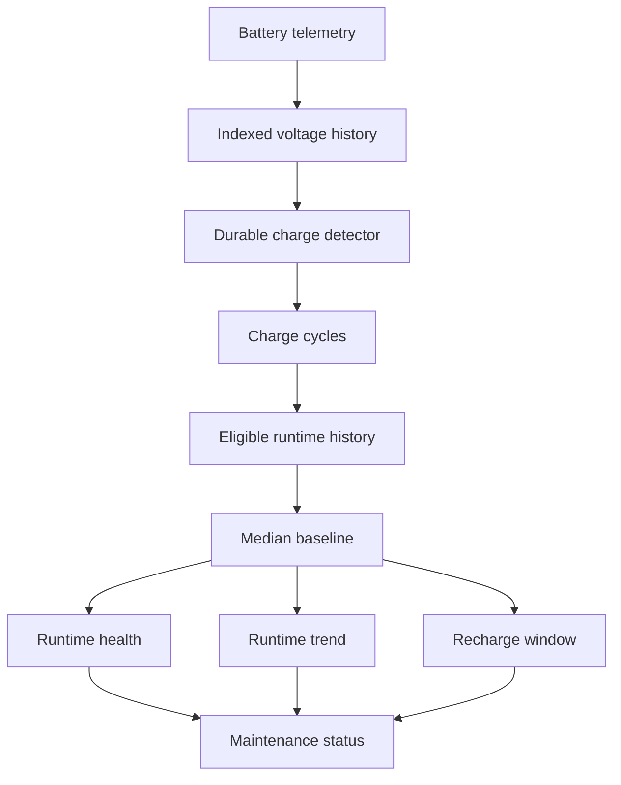

# Battery runtime monitoring

The gateway tracks measured battery voltage and observed charge-cycle runtime. It does not calculate state-of-charge percentage or absolute remaining capacity because no battery chemistry, discharge curve, charger profile, or cutoff behavior has been validated for this deployment.

## Concepts and lifecycle

- Battery voltage is the MG24's measured electrical value.
- A charge cycle is one observed period between confirmed charge events.
- Charge runtime is the UTC wall-clock cycle duration, retained alongside confirmed observed and unobserved seconds.
- The runtime baseline is the median of the first configured number of eligible completed cycles in the current physical battery generation.
- Runtime health is recent median eligible runtime divided by that baseline. It is not state of charge or measured capacity.
- Recharge prediction is a bounded estimate from recent eligible runtimes minus current elapsed runtime.
- Replacement status is a maintenance recommendation based on consecutive comparable degraded cycles.

The first valid voltage observation creates generation 1 and an active cycle. State is stored in SQLite, so gateway restarts do not lose the active cycle or charge candidate. A changed sensor boot ID increments the cycle reboot counter but does not start a cycle.

## Automatic charge detection

The detector moves through `DISCHARGING`, `POSSIBLE_CHARGING`, and `CHARGING`. It starts a candidate only when voltage rises beyond the noise floor. Confirmation requires a cumulative minimum rise, multiple samples, and a minimum elapsed duration. After confirmation, voltage must remain within the noise floor for a stable duration before the previous runtime cycle closes and a new active cycle starts.

Defaults are conservative detection heuristics, not battery chemistry specifications:

| Setting | Default |
|---|---:|
| Minimum voltage rise | 0.12 V |
| Noise floor | 0.02 V |
| Confirmation duration | 120 s |
| Minimum samples | 3 |
| Stable-voltage duration | 300 s |
| Maximum continuous sample gap | 900 s |

One spike, small ADC jitter, a gateway restart, or a sensor reboot cannot independently create a new cycle. Sites must validate and tune these values against physical charger behavior.

High-rate packets are all retained by telemetry persistence, but battery detector state is updated at a bounded five-second cadence by default. Gateway telemetry and vibration database writes are serialized before entering SQLite, preventing concurrent BLE callbacks from competing for SQLite's single writer. The cadence is configurable with `SEED_MG24_BATTERY_PROCESSING_INTERVAL_SECONDS` and remains well below the default multi-minute charge confirmation windows.

## Manual maintenance events and generations

`POST /api/devices/{id}/battery/mark-charged` closes the active cycle when present and starts the next cycle without changing identity, provisioning, firmware, or lifecycle state. The request can explicitly identify a partial charge; that completed cycle is retained but excluded from baseline calculations.

`POST /api/devices/{id}/battery/replace` closes the active cycle as ineligible, closes the old battery generation, records an audit and replacement event, then opens generation N+1 and cycle 1. All older generations remain queryable. The new physical battery learns an independent baseline. Replacement never factory-resets or reprovisions the sensor and never deletes telemetry.

## Observability, outliers, and workload context

Successive samples no farther apart than the configured maximum gap add confirmed observed time. Larger gaps add unobserved time; they are not classified as battery depletion. A completed cycle exceeding the maximum unobserved ratio is retained with `LOW_OBSERVABILITY` and excluded from the baseline. This distinguishes sensor runtime evidence from gateway downtime or BLE range loss.

Cycles snapshot firmware, protocol, and the active installation-configuration fingerprint. A changed fingerprint marks the completed cycle `CONFIG_CHANGED`. Explicit partial charges are `PARTIAL_CHARGE`; battery replacement is `BATTERY_REPLACED`. None are deleted. Cycle summaries also retain telemetry count, event count, reboot count, configuration-change count, and room for vibration-window workload. An offline sensor remains offline/unknown unless separate evidence supports depletion.

## Baseline, health, trend, and replacement

The default baseline minimum is five eligible completed cycles. Before then the state is `LEARNING`. Once learned, the baseline is the median of the initial eligible cycles, which resists one unusual runtime better than a mean or maximum. Average-last-5 and average-last-10 displays use only eligible comparable cycles.

Runtime health uses the median of the latest three eligible runtimes divided by the baseline. The explainable trend is ordinary least-squares slope across normalized runtimes in the configured lookback. A slope above 0.03 per cycle is `IMPROVING`, at least -0.02 is `STABLE`, at least -0.06 is `DECLINING_SLOWLY`, and lower is `DECLINING_RAPIDLY`. These trend boundaries are analytics heuristics.

Replacement policy defaults to `AGING` below 0.90, `PLAN_REPLACEMENT` below 0.75, and `REPLACE` below 0.60, only when all of the configured consecutive recent cycles (three by default) cross the applicable threshold. One short cycle cannot trigger replacement. The API includes the baseline, recent runtimes, health ratio, and policy outcome so maintenance can audit the recommendation.

When enough comparable cycles show a meaningful decline, the gateway also projects broad days-out windows for reaching the plan-replacement and replace thresholds. It fits a linear runtime-ratio change per cycle over the configured lookback, converts projected cycles to days using the median of the latest three eligible cycle runtimes, and reports a ±25% slope window. Confidence uses history depth and regression fit. The forecast is unavailable while learning, for stable/improving trends, or when decline is too small to extrapolate; it is maintenance planning guidance rather than an exact failure date.

## Recharge prediction and confidence

Prediction is unavailable until the current generation has enough eligible cycles and an active cycle. It uses the median of up to ten recent eligible runtimes as the center, the observed 25th and 75th percentile positions as a conservative window, and subtracts current elapsed runtime. Values never go below zero. This is an expected window, not a precise cutoff time.

Confidence considers eligible history depth, runtime coefficient of variation, and active-cycle observability. Ten stable, highly observable cycles can be `HIGH`; normal learned history is `MEDIUM`; high variability or low observability is `LOW`; insufficient history is `UNKNOWN`. Configuration-incompatible and low-observability cycles are excluded.

## Voltage and alerts

Raw battery readings remain in the indexed readings table; dashboard history uses a bounded time window and row limit. The summary uses indexed point lookups for values at or before one hour and 24 hours ago, plus a bounded 24-hour aggregate for change/hour, change/day, recent minimum, recent maximum, and sample count. These describe voltage movement but do not infer state of charge. Completed cycle summaries survive raw-reading retention.

Low-voltage warning and critical values are disabled until explicitly configured and field validated. Immediate voltage state is separate from runtime degradation. Alert records use a configurable cooldown and cover insufficient data, recharge soon, runtime degradation, replacement planning/requirement, and configured voltage warning/critical states.

## API and dashboard

- `GET /api/devices/{id}/battery`
- `GET /api/devices/{id}/battery/cycles`
- `GET /api/devices/{id}/battery/cycles/{cycle_id}`
- `GET /api/devices/{id}/battery/history`
- `POST /api/devices/{id}/battery/mark-charged`
- `POST /api/devices/{id}/battery/replace`

Mutation routes use the gateway's bounded same-origin JSON protection. The Battery dashboard tab shows measured voltage, runtime history, runtime health, prediction confidence, replacement explanation, cycle eligibility, and lightweight voltage/runtime charts. Percentage is shown only as not calibrated.

## Required physical validation

Record all of the following before treating percentage, capacity, cutoff, or precise remaining-hours estimates as calibrated:

- exact battery chemistry, manufacturer, model, rated capacity, age, and lot;
- charger IC behavior, charge termination, recharge hysteresis, and full-charge voltage behavior;
- real loaded and resting discharge curve, actual cutoff/depletion behavior, and brownout behavior;
- sleep current and normal operating current;
- BLE advertising, connection, and transmission current;
- IMU sampling/processing current and event-mode/raw-capture current;
- temperature effects on voltage, usable capacity, charging, and runtime;
- repeated full physical charge/discharge lifetime measurements under representative configurations.

Until those measurements exist, report only measured voltage, observed runtime, runtime relative to an established observed baseline, and confidence-labeled statistical recharge windows.
