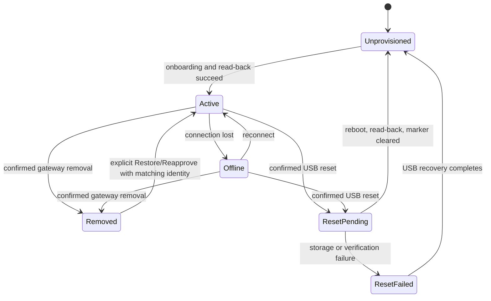

# Sensor removal, restoration, and factory reset

These are separate lifecycle operations. None deletes historical readings.

## Remove and Restore/Reapprove

**Remove Sensor** archives and disables the gateway registration and associated installations, stops its managed BLE connection, clears pending commands and runtime state, and writes an audit event. It preserves readings and does not send a reset command to the sensor. A still-provisioned sensor can continue advertising, but telemetry, heartbeat, reconnect, import, and ordinary onboarding cannot reactivate it.

Use **Restore/Reapprove** to reactivate the same archived database record. The immutable MCU hardware ID (when recorded) and BLE identity must match the tombstone. This retains all foreign-key relationships and history. A mutable sensor ID cannot be assigned to different hardware; resolve the identity conflict instead of creating a duplicate.

Permanent telemetry deletion is not part of either workflow.

## Physical factory reset

Factory reset is available only over a directly connected USB serial transport. The dashboard service is loopback-only, and both the browser confirmation and firmware challenge are short-lived, single-use, and bound to the mutable sensor ID, immutable hardware ID, port, reset scope, and operation. The operator must type the displayed immutable hardware ID. There is no BLE factory-reset command.

The application factory scope clears only the allowlisted keys in `sensor_package/reset_scope.json`: both identity slots, both configuration slots, configuration staging, and application store metadata. It preserves the reset transaction marker until verified boot completion. It also preserves the bootloader, installed firmware and version, immutable MCU identity, manufacturer data, hardware factory calibration, and all Silicon Labs/Bluetooth-stack storage. The application does not create bonds, so no blanket Bluetooth bond deletion is performed.

Before reboot, firmware writes and verifies the integrity-protected `0x0FF06` marker, suppresses normal writes and telemetry, deletes and reads back every resettable key, clears runtime state, returns a structured result, and calls `systemReset()`. On boot, any valid, corrupt, or uncleared reset state keeps the device in non-telemetry bootstrap mode. Firmware rechecks the reset scope and unprovisioned state before deleting and verifying removal of the marker. A marker-clear failure remains a recoverable safe-storage fault; normal telemetry never resumes.

## Operator workflow

1. Back up state to a protected, ignored location with `backup_node.ps1` or the bootstrap CLI. Backups may contain operational configuration; do not place them in normal logs or Git.
2. Connect exactly one supported XIAO MG24 Sense, or specify an explicit serial port.
3. Run `sensor_package/scripts/list_nodes.ps1` (or `.sh`) and compare the immutable hardware ID, firmware, current sensor ID, provisioning state, and port with the dashboard selection.
4. In the dashboard choose **Factory Reset**, select the matching USB device, type its exact hardware ID, and confirm. The equivalent CLI is `factory_reset.ps1 -Port COM3 -HardwareId 0x0123456789ABCDEF -Confirm`.
5. Wait for reboot/re-enumeration. Success is reported only after read-back shows an unprovisioned sensor with the same hardware ID and firmware version and gateway cleanup succeeds.
6. Use Add Sensor to onboard it as a new unprovisioned package. The old mutable sensor ID is not reused automatically.

### Reset and Re-register Sensor

The dashboard also offers one guided **Reset and Re-register Sensor** workflow. It composes the same USB reset,
lifecycle, BLE onboarding, and gateway registration services; it does not implement a second reset path. The gateway
stores a non-secret operation record so setup can resume after a browser or gateway restart. Reset challenges and
confirmation tokens are process-local and never appear in saved workflow state, status responses, audit records, or
downloaded summaries. Restart recovery performs physical read-back and never repeats a destructive reset command.

The wizard verifies the selected immutable hardware ID over USB, creates an allowlisted application-configuration
backup, requires hardware-specific reset confirmation, waits for re-enumeration even if the COM port changes, and
does not advance until the backend verifies an unprovisioned non-telemetry bootstrap state. The operator must then
explicitly choose one of these registration paths:

* **Reuse previous registration details** uses Restore/Reapprove semantics and the existing archived record. It is
  permitted only for the same immutable hardware identity, and it never happens automatically.
* **Register as a new sensor** creates a new active record after provisioning. The prior record and its historical
  telemetry remain archived; readings are not silently reassociated.

BLE onboarding currently does not expose the immutable MCU hardware ID in its discovery metadata. The wizard therefore
shows every unprovisioned candidate, never chooses among multiple candidates, and requires explicit physical
correlation. USB identity remains authoritative. Adding a hardware-ID field to the authenticated/bootstrap BLE
onboarding protocol would remove this remaining correlation limitation.

Completion requires an active matching gateway record, managed BLE connection, and a telemetry or heartbeat received
after the workflow began. Until then the truthful result is **Registered—waiting for first telemetry**, with Retry
Connection and Finish Later available. The non-sensitive operation summary excludes credentials, configuration values,
reset challenges, and confirmation tokens.

If physical reset succeeds but gateway cleanup fails, the dashboard reports partial failure and polling/retry safely repeats only the idempotent cleanup. The gateway records `reset_pending` before execution and retains it across a gateway restart; use the ordinary confirmed removal workflow to reconcile a stranded pending registration if the in-memory USB operation was lost. If power is lost, reconnect USB and allow boot recovery to finish before onboarding. Do not upload firmware or operate a physical sensor without the operator's explicit authorization.

## Security limitation

Destructive browser requests require bounded JSON, exact scheme/host/port same-origin validation, and explicit expiring confirmation tokens. USB execution additionally requires both a loopback peer and loopback Host, rejects forwarded-client headers, and requires exact hardware identity. Do not publish or reverse-proxy the USB reset routes. The dashboard does not yet provide full user authentication or TLS; deploy it only on a trusted host/network until those controls are added. A future BLE reset would require an explicitly approved authenticated design and is intentionally absent.
