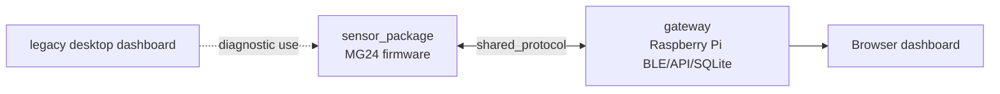

# System architecture

The sensor package owns code executing on or directly programming the MG24. The gateway owns Raspberry Pi runtime and presentation. Shared protocol schemas are the sole cross-component data contract. The legacy desktop tool is retained but is not a gateway dependency.
